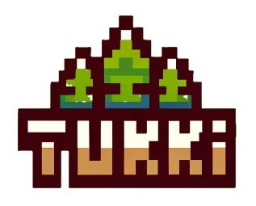

   

# tukki

A toy distributed key-value store built to explore log-structured merge-tree (LSM tree) and replication concepts.

<br />

> [!WARNING]
> This is a toy database not fit for production use. It will eat your data.


## Operations

tukki supports following operations:

* Get key
* Get by range
* Set key
* Delete key
* Delete by range

Keys and values are both UTF-8 strings.

## Building

```bash
$ make build
```

## Running

### Server

Single node server can be run as

```bash
$ ./bin/server --help
Usage of ./bin/server:
  -db-dir string
    	The directory to store the database (default "./tukki-db")
  -port int
    	The server port (default 50051)

$ ./bin/server
2024/09/15 13:17:40 journal file exists tukki-db/segment_operations.journal, reading journal
2024/09/15 13:17:40 opening journal for appending
2024/09/15 13:17:40 journal file exists tukki-db/wal-0.journal, reading journal
2024/09/15 13:17:40 opening journal for appending
```

For multi-node setup see [tukkid](./cmd/tukkid).

### Client

```bash
$ ./bin/client --help
Usage of ./bin/client:
  -hostname string
    	The server hostname (default "localhost")
  -port int
    	The server port (default 50051)

$ ./bin/client
> SET foo bar
Key set (876.041µs)
> GET foo
value: bar (929.875µs)
> GET FOO
failed to get: rpc error: code = Unknown desc = key not found in segments (951.625µs)
```

## gRPC Interface

tukki exposes a gRPC interface for its operations. The client and server commands
use this interface to communicate.

```proto
service KvService {
    rpc Query(QueryRequest) returns (QueryResponse) {}
    rpc Set(SetRequest) returns (SetResponse) {}
    rpc Delete(DeleteRequest) returns (DeleteResponse) {}
}
```

The complete protocol can be seen in [tukki.rpc](proto/tukki/rpc/).


## Replication

tukki currently uses Hashicorp's [Raft](https://github.com/hashicorp/raft) library of [Raft Consensus Algorithm](https://raft.github.io/) for concensus and replication.

The current storage backend for Raft needs is Badgerdb, but the goal is to eventually use tukki itself for all storage needs.

## Database structures

### Memtable

Memtable is an in-memory representation of the current live segment. Writes are
buffered there until written to disk but also newest values are read from it.
Memtable needs to be a an ordered datastructure as the subsequent disk format is
sorted by keys.

tukki uses a red black tree for its memtable.


### Disk format

tukki uses length prefixed protobuf messages as on disk format for all its types.

```
 0                   1                   2                   3   
 0 1 2 3 4 5 6 7 8 9 0 1 2 3 4 5 6 7 8 9 0 1 2 3 4 5 6 7 8 9 0 1 
+-+-+-+-+-+-+-+-+-+-+-+-+-+-+-+-+-+-+-+-+-+-+-+-+-+-+-+-+-+-+-+-+
|                         Message Length                        |
+-+-+-+-+-+-+-+-+-+-+-+-+-+-+-+-+-+-+-+-+-+-+-+-+-+-+-+-+-+-+-+-+
|                        Protobuf message                       |
+                                                               +
```

Length is a 32-bit unsigned integer which represents how many following bytes 
the message takes.

The messages are specificed at [`tukki.storage` protobuf package](proto/tukki/storage/).


### Write-Ahead Log

Database writes are first written to a write-ahead log (WAL). [In the style of 
MongoDB](https://www.mongodb.com/docs/manual/reference/configuration-options/#mongodb-setting-storage.journal.commitIntervalMs), the WAL writes are batched and flushed to disk every 100 ms.

```
         +-----------+         +----------+
  Write  |           |  Write  |          |
-------->|    WAL    +-------->| Memtable |
         |           |         |          |
         +-----------+         +----------+
```

Memtable can be constructed from WAL on restart or crash recovery.

WAL on disk is a series of:

```proto
message WalEntry {
    string key = 1;
    string value = 2;
    bool deleted = 3;
}
```

### SSTable

Sorted-String Table (SSTable) is the on-disk format of the database segments.
SSTables are immutable files but can be merged and compacted.

SSTable on disk is a series of:

```proto
message SSTableRecord {
    string key = 1;
    string value = 2;
    bool deleted = 3;
}
```

### Bloom filters

tukki uses bloom filters for fast key memberships tests to find relevant segments.

### Indexes

Tukki has per segment primary key indexes. The indexes are stored as series of

```proto
message IndexEntry {
    string key = 1;
    uint64 offset = 2;
}
```

i.e. each IndexEntry tells at which offset a key's record is located in the
segment file.

### Segment journal

Segment journal records creation of new segments and merging existing segments. 
Segment journal is read at startup to find all segments and possible incomplete
operations.

### Segment merging

Segment merging is not yet implemented.